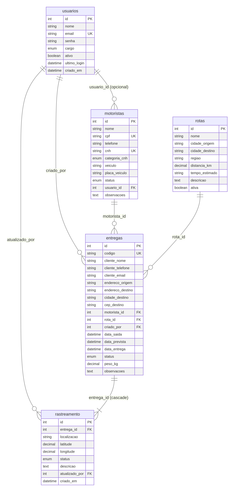

# LogiTrack — Sistema de Logística e Rastreamento de Entregas

O **LogiTrack** é uma plataforma web profissional completa desenvolvida para gerenciar e rastrear entregas, motoristas e rotas logísticas em tempo real através de um painel administrativo dinâmico e responsivo.

Este projeto foi projetado como trabalho de conclusão do curso de Desenvolvimento de Sistemas, utilizando as melhores práticas de arquitetura de software, segurança, integridade referencial e design de interface.

---

## 🚀 Funcionalidades Principais

* **Dashboard Inteligente:** Métricas operacionais em tempo real (Total de entregas, concluídas, em rota, atrasadas, pendentes, total de motoristas ativos) com gráficos dinâmicos (Chart.js) de entregas por status e volume de entregas diárias.
* **Módulo de Entregas (CRUD Completo):** Cadastro, listagem, edição e exclusão de entregas, com geração automática de código único de rastreamento (`LT-AAAA-XXXX`), controle de prazos e alertas de atraso automáticos baseados na data prevista.
* **Módulo de Motoristas (CRUD Completo):** Gestão de motoristas com controle de status (`ativo`, `em_rota`, `inativo`, `ferias`), CPF, telefone, número e categoria de CNH (`A`, `B`, `C`, `D`, `E`) e veículo associado.
* **Módulo de Rotas (CRUD Completo):** Gestão de trajetos logísticos registrando cidades de origem e destino, região, distância em quilômetros, tempo estimado e descrição da rota.
* **Rastreamento em Tempo Real:** Atualização de localização e status das entregas, gerando um histórico detalhado e cronológico de movimentações com identificação do operador responsável.
* **Exportação de Dados:** Exportação da listagem de entregas com filtros aplicados diretamente para planilhas **Excel** (`.xlsx`) ou relatórios formatados em **PDF** (`.pdf`).
* **Sistema de Autenticação e Permissões:** Login moderno com controle de sessão via **JWT**, criptografia de senhas com **Bcrypt** e controle de permissões por cargo (`administrador`, `operador`, `motorista`).

---

## 🛠️ Tecnologias Utilizadas

### Frontend
* **HTML5** & **CSS3** (Tema escuro profissional, layout responsivo com CSS Grid e Flexbox, design limpo sem dependências de frameworks CSS externos).
* **JavaScript (ES6+)** (Gerenciamento de estado local, consumo de API assíncrona com `fetch`, manipulação de DOM).
* **Chart.js** (Gráficos interativos).

### Backend
* **Node.js** & **Express** (API REST robusta, roteamento estruturado, tratamento de erros centralizado).
* **MySQL** (Banco de dados relacional com integridade referencial, chaves estrangeiras, índices e constraints).
* **JWT (jsonwebtoken)** (Autenticação baseada em token sem estado).
* **BcryptJS** (Criptografia segura de senhas).
* **ExcelJS** & **PDFKit** (Geração de relatórios de exportação no servidor).

---

## 📁 Estrutura do Projeto

O projeto segue uma arquitetura profissional e organizada de pastas:

```text
/LogiTrack
  /backend
    /config         # Conexão com banco de dados e scripts SQL
    /controllers    # Lógica de negócios e regras da API
    /middlewares    # Autenticação JWT, permissões e tratamento de erros
    /routes         # Definição de rotas REST
    server.js       # Arquivo principal de inicialização
  /frontend
    /css            # Estilização (style.css - Tema Escuro)
    /js             # Scripts do frontend (app.js, auth.js, dashboard.js, entregas.js, modules.js)
    index.html      # Interface web única (Single Page Application funcional)
  /docs             # Documentação técnica e Diagrama ER
```

---

## 📈 Modelagem do Banco de Dados (Diagrama ER)

O banco de dados relacional foi modelado para garantir integridade referencial total e alto desempenho.



---

## 📚 Documentação Técnica

Para instruções detalhadas de instalação e uso das APIs, consulte os documentos na pasta `/docs`:

1. [Manual de Instalação e Configuração](docs/manual_instalacao.md)
2. [Documentação das Rotas da API REST](docs/api_docs.md)
3. [Script SQL de Criação do Banco](backend/config/database.sql)

---

## 👥 Contas de Demonstração para Apresentação

Para testar o sistema rapidamente, utilize uma das contas de teste criadas por padrão no script SQL:

| Cargo | E-mail | Senha |
| :--- | :--- | :--- |
| **Administrador** | `admin@logitrack.com` | `password` |
| **Operador Logístico** | `operador@logitrack.com` | `password` |
